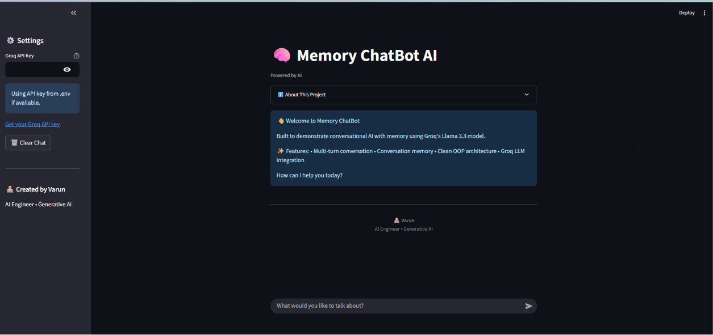
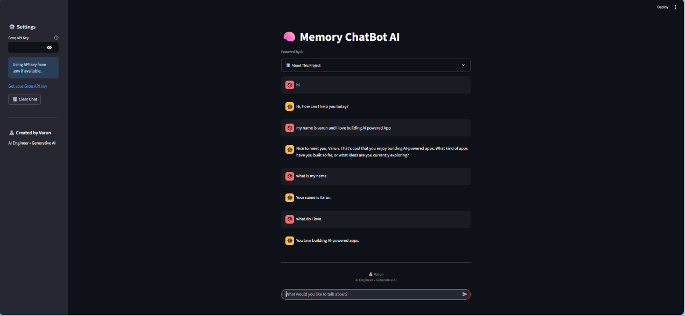
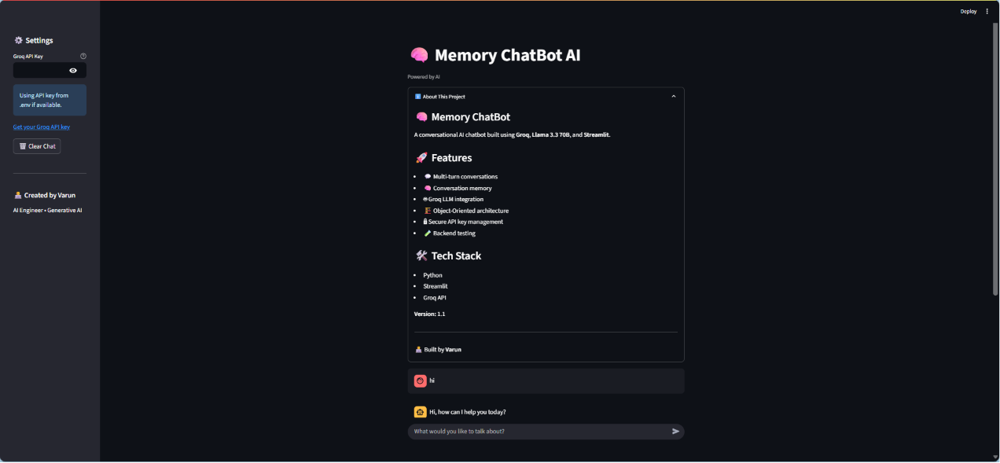

# 🧠 Memory ChatBot Gemini

<p align="center">


</p>

<p align="center">

### 💬 A production-ready conversational AI chatbot powered by Google Gemini and Streamlit.

Designed to demonstrate clean software architecture, Object-Oriented Programming, secure API management, conversation memory, and modern AI application development.

</p>

---

# 📸 Application Preview

## 🏠 Home Screen



---

## 💬 Chat in Action



---

## ℹ️ About Section



---

# ✨ Features

## 🤖 AI Features

- 💬 Multi-turn conversations
- 🧠 Conversation memory
- 🤖 Google Gemini integration
- ⚡ Fast AI responses

## 💻 Software Engineering

- 🏗️ Object-Oriented Architecture
- 🧪 Backend testing
- 📝 Logging support
- 🔒 Secure API key management
- ⚠️ Error handling

## 🎨 User Experience

- 👋 Welcome screen
- ℹ️ About section
- 🗑️ Clear chat button
- 🔑 API key override from sidebar
- 🎨 Professional UI
- 👨‍💻 Personal branding

---

# 🛠️ Tech Stack

| Technology | Purpose |
|------------|----------|
| Python | Programming Language |
| Streamlit | Web Application Framework |
| Google Gemini API | Large Language Model |
| python-dotenv | Environment Variable Management |

---

# 🏛️ System Architecture

```text
                User
                  │
                  ▼
         Streamlit Frontend
                  │
                  ▼
          ChatBot Backend
                  │
                  ▼
          Google Gemini API
                  │
                  ▼
          AI Generated Response
```

---

# 📂 Project Structure

```text
memory-chatbot-gemini/
│
├── assets/
│   ├── home.png
│   ├── chat.png
│   └── about.png
│
├── tests/
│   └── test_backend.py
│
├── app.py
├── backend.py
├── config.py
├── requirements.txt
├── .gitignore
├── .env.example
├── LICENSE
└── README.md
```

---

# ⚙️ Installation

## 1️⃣ Clone the Repository

```bash
git clone https://github.com/varun0852/memory-chatbot-gemini.git

cd memory-chatbot-gemini
```

---

## 2️⃣ Create a Virtual Environment

### Windows

```bash
python -m venv .venv
.venv\Scripts\activate
```

### Linux / macOS

```bash
python3 -m venv .venv
source .venv/bin/activate
```

---

## 3️⃣ Install Dependencies

```bash
pip install -r requirements.txt
```

---

## 4️⃣ Configure Environment Variables

Create a `.env` file.

```env
GOOGLE_API_KEY=YOUR_GOOGLE_GEMINI_API_KEY
```

Get your free API key from:

https://aistudio.google.com/app/apikey

---

## ▶️ Run the Application

```bash
streamlit run app.py
```

Open:

```
http://localhost:8501
```

---

# 🧪 Running Tests

```bash
python tests/test_backend.py
```

---

# 🚀 Engineering Highlights

This project demonstrates:

- ✅ Object-Oriented Programming
- ✅ Clean Project Structure
- ✅ Backend Testing
- ✅ Logging
- ✅ Environment Variable Management
- ✅ Secure API Handling
- ✅ Conversation Memory
- ✅ Professional Streamlit UI

---

# 📚 What I Learned

Building this project helped me strengthen my understanding of:

- Google Gemini API integration
- Building conversational AI applications
- Object-Oriented Programming in Python
- Secure API key management
- Backend testing and debugging
- Git & GitHub workflows
- Logging and error handling
- Streamlit application development

---

# 🔮 Future Improvements

- 📄 PDF Chat Support
- ⚡ Streaming Responses
- 🐳 Docker Support
- 🔄 CI/CD Pipeline
- 💾 Chat Export
- 🎨 Theme Switcher
- 🤖 Multi-model Support
- 🚀 Migration to Google GenAI SDK

---

# 🤝 Connect With Me

## 👤 Author

**Varun** — AI/ML Engineer

[](https://www.linkedin.com/in/varun-a87781274/)
[](https://github.com/varun0852)
[](mailto:diwakarvarun752@gmail.com)

Feel free to connect with me or discuss AI, Machine Learning, and Generative AI.

---

# ⭐ Support

If you found this project helpful, please consider giving it a ⭐ on GitHub.

Your support motivates me to continue building and sharing AI projects.

---

# 📄 License

This project is licensed under the **MIT License**.

---

<p align="center">

### Built with ❤️ by Varun

**AI Engineer • Generative AI • Machine Learning**

</p>
