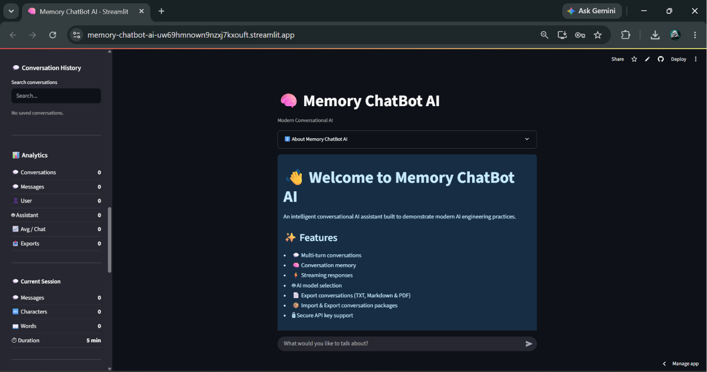
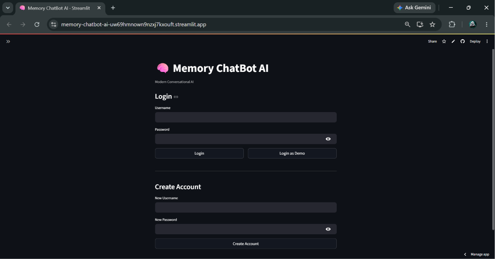
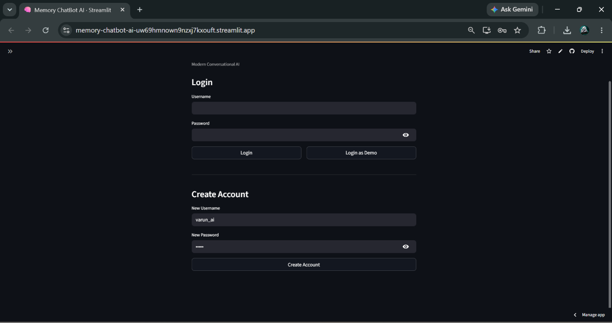
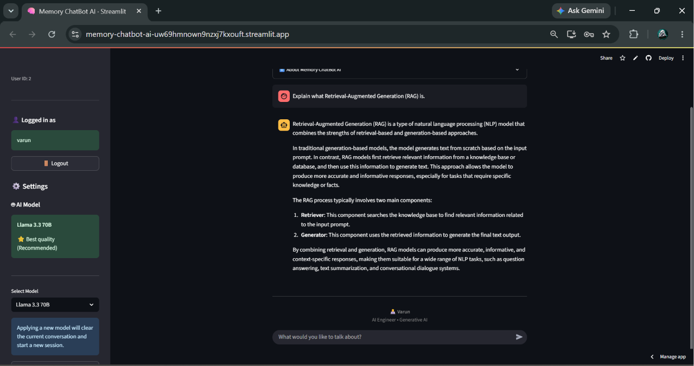
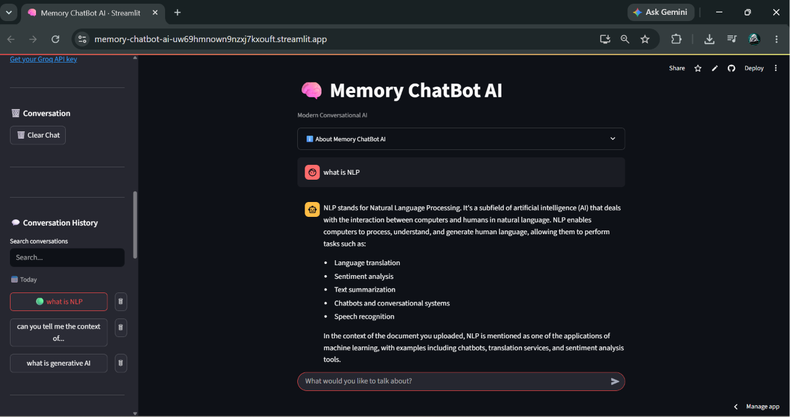
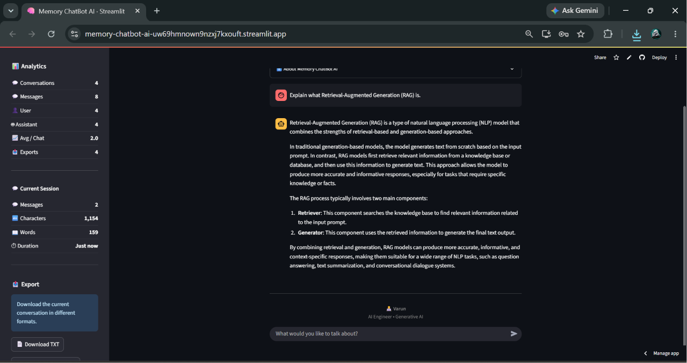
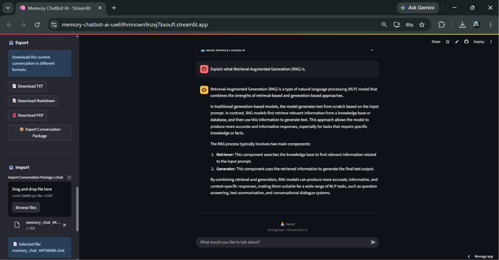
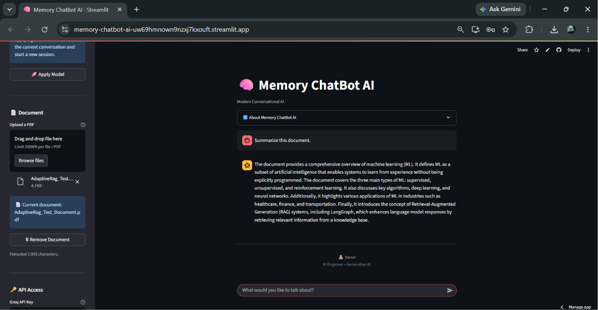

# 🤖 Memory ChatBot AI

A production-ready conversational AI assistant built with **Streamlit**, **Groq LLM**, and modern AI engineering practices.

Memory ChatBot AI provides secure user authentication, private conversation history, PDF document chat, conversation analytics, multiple export formats, conversation import, and an intuitive interface for interacting with Large Language Models.

Designed with a modular architecture, automated testing, and clean software engineering principles, this project demonstrates how to build a scalable AI application suitable for real-world deployment.

---

[](https://www.python.org/)
[](https://streamlit.io/)
[](https://groq.com/)
[](https://www.sqlite.org/)
[](LICENSE)

---

# 🚀 Live Demo

### 🌐 Try Memory ChatBot AI

**https://memory-chatbot-ai-uw69hmnown9nzxj7kxouft.streamlit.app/**

---

# 🎬 Demo

<p align="center">

</p>

---

# 🖥️ Application Overview

<p align="center">

</p>

Memory ChatBot AI combines conversational AI with modern productivity features, allowing users to securely manage conversations, chat with PDF documents, analyze usage statistics, and import or export conversations in multiple formats.

---
# 📸 Screenshots

## 🔐 Secure Login

Users can securely sign in to access their private conversations. Passwords are securely hashed using **bcrypt**, and a built-in **Demo Account** is available for quick exploration.

<p align="center">

</p>

---

## 👤 Create Account

Create a new account in seconds. Every user has isolated conversation history, analytics, and exported conversations.

<p align="center">

</p>

---

## 💬 AI Chat Interface

A clean conversational interface supporting real-time streaming responses from Groq-powered Large Language Models.

Features shown:

- Multi-turn conversations
- Streaming AI responses
- Session management
- Modern chat interface

<p align="center">

</p>

---

## 📚 Conversation History

Every conversation is automatically saved and organized.

Features:

- Search conversations
- Load previous chats
- Delete conversations
- Date grouping
- Private history for every user

<p align="center">

</p>

---

## 📊 Analytics Dashboard

Track your AI usage with built-in analytics.

Metrics include:

- Total Conversations
- Total Messages
- User Messages
- Assistant Messages
- Average Messages per Conversation
- Export Statistics

<p align="center">

</p>

---

## 📤 Import & Export

Export conversations in multiple formats or import previously saved conversation packages.

Supported formats:

- 📄 TXT
- 📝 Markdown
- 📕 PDF
- 📦 Memory Chat Package (.chat)

<p align="center">

</p>

---

## 📄 Chat with PDF Documents

Upload PDF documents and ask questions directly about their content.

Capabilities include:

- PDF Upload
- Automatic Text Extraction
- Context-aware AI Responses
- Remove Documents Anytime

<p align="center">

</p>

---
# ✨ Features

## 🔐 User Authentication

Secure authentication ensures every user's data remains private.

### Authentication Features

- 👤 Create a new account
- 🔑 Secure login & logout
- 🎭 Built-in Demo Account
- 🔒 Password hashing with **bcrypt**
- 🛡️ User-specific conversation history
- 📊 User-specific analytics

---

## 💬 Intelligent Conversation Management

Designed for long-running AI conversations with persistent memory.

### Features

- Multi-turn AI conversations
- Persistent conversation history
- Automatic conversation saving
- Conversation search
- Conversation deletion
- Session management
- Conversation titles generated automatically

---

## 🤖 AI-Powered Chat Experience

Powered by **Groq Large Language Models** for fast and intelligent responses.

### AI Features

- ⚡ Real-time streaming responses
- 🧠 Context-aware conversations
- 🔄 Multiple AI model selection
- 📝 Markdown rendering
- Robust error handling
- Secure API key management

---

## 📄 Chat with PDF Documents

Interact with uploaded PDF documents naturally.

### Document Features

- Upload PDF files
- Automatic text extraction
- Ask questions about documents
- Context-aware document responses
- Remove uploaded documents anytime

---

## 📤 Import & Export

Move conversations between devices or save them for future reference.

### Export Formats

- 📄 Plain Text (.txt)
- 📝 Markdown (.md)
- 📕 PDF (.pdf)
- 📦 Memory Chat Package (.chat)

### Import Features

- Restore exported conversations
- Preserve metadata
- Create new conversation sessions automatically

---

## 📊 Conversation Analytics

Understand how you use the chatbot through built-in statistics.

### Analytics Dashboard

- Total conversations
- Total messages
- User messages
- Assistant messages
- Average messages per conversation
- Total exports
- Session statistics

---

## 🗄️ Database & Persistence

Built on SQLite with a modular persistence layer.

### Database Features

- SQLite storage
- Persistent conversations
- User account management
- Private conversation isolation
- Export tracking

---

## 🛠️ Software Engineering

The project follows modern software engineering best practices.

### Engineering Features

- Modular architecture
- Object-oriented design
- Automated testing
- Ruff linting
- Black formatting
- Type hints
- Clean code principles
- Production-ready project structure

---
# 🏗️ Architecture

Memory ChatBot AI follows a modular architecture that separates the user interface, business logic, database layer, and utilities into independent components for better scalability and maintainability.

```text
                          ┌────────────────────┐
                          │       User         │
                          └─────────┬──────────┘
                                    │
                                    ▼
                     ┌──────────────────────────┐
                     │     Streamlit Frontend   │
                     └─────────┬────────────────┘
                               │
        ┌──────────────────────┼─────────────────────────┐
        ▼                      ▼                         ▼
 Authentication         Chat Components           Sidebar Components
        │                      │                         │
        ▼                      ▼                         ▼
 User Database          ChatBot Engine        History • Analytics
        │                      │              Import • Export
        │                      ▼
        │               Groq LLM API
        │
        ▼
SQLite Database
│
├── Users
├── Conversations
└── Statistics
```

---

# 🛠️ Tech Stack

| Category | Technology |
|-----------|------------|
| **Programming Language** | Python 3.11 |
| **Frontend** | Streamlit |
| **Large Language Model** | Groq |
| **Authentication** | bcrypt |
| **Database** | SQLite |
| **PDF Processing** | PyPDF2 |
| **PDF Generation** | ReportLab |
| **Environment Variables** | python-dotenv |
| **Testing** | Pytest |
| **Formatting** | Black |
| **Linting** | Ruff |
| **Version Control** | Git & GitHub |
| **Deployment** | Streamlit Community Cloud |

---

# 📁 Project Structure

```text
MemoryChatbot/
│
├── assets/
│   ├── demo/
│   │   └── memory-chatbot-demo.gif
│   │
│   └── screenshots/
│       ├── hero.png
│       ├── login-page.png
│       ├── create-account.png
│       ├── main-chat.png
│       ├── conversation-history.png
│       ├── analytics.png
│       ├── export-import.png
│       └── pdf-chat.png
│
├── backend/
│   ├── chatbot.py
│   ├── groq_client.py
│   └── exceptions.py
│
├── components/
│   ├── auth.py
│   ├── logout.py
│   ├── analytics.py
│   ├── conversation_history.py
│   ├── document_section.py
│   ├── export_section.py
│   ├── import_section.py
│   ├── model_selector.py
│   └── ...
│
├── database/
│   ├── conversation_db.py
│   └── user_db.py
│
├── models/
├── tests/
├── utils/
├── docs/
├── .streamlit/
│
├── app.py
├── config.py
├── requirements.txt
├── README.md
├── ROADMAP.md
├── CHANGELOG.md
├── RELEASE_NOTES.md
└── LICENSE
```

---

# 🔑 Key Highlights

- 🔐 Secure user authentication
- 💬 Persistent conversation history
- 📄 Context-aware PDF document chat
- 📤 Conversation import & export
- 📊 Built-in analytics dashboard
- ⚡ Streaming AI responses
- 🧪 Automated testing with Pytest
- 🏗️ Modular and scalable architecture
- 🚀 Cloud deployment on Streamlit Community Cloud

---
# 🔧 Installation

## 1️⃣ Clone the Repository

```bash
git clone https://github.com/varun0852/memory-chatbot-ai.git

cd memory-chatbot-ai
```

---

## 2️⃣ Create a Virtual Environment

### Windows

```bash
python -m venv .venv

.venv\Scripts\activate
```

### Linux / macOS

```bash
python3 -m venv .venv

source .venv/bin/activate
```

---

## 3️⃣ Install Dependencies

```bash
pip install -r requirements.txt
```

---

# ⚙️ Configuration

Create a `.env` file in the project root.

```env
GROQ_API_KEY=your_groq_api_key
```

You can obtain a free API key from:

https://console.groq.com/

---

# 🚀 Run the Application

Start the Streamlit application.

```bash
streamlit run app.py
```

The application will open in your browser at:

```text
http://localhost:8501
```

---

# 👤 Getting Started

After launching the application, you have two ways to access Memory ChatBot AI.

## Option 1 — Create a New Account

1. Enter a username.
2. Enter a password.
3. Click **Create Account**.
4. Login using your new credentials.

---

## Option 2 — Use the Demo Account

A demo account is available for quickly exploring the application.

**Username**

```text
demo
```

**Password**

```text
demo123
```

---

# 🔑 Authentication

Every user has their own private workspace.

Authentication provides:

- Secure password hashing using **bcrypt**
- Private conversation history
- User-specific analytics
- User-specific exported conversations
- Secure login and logout

No conversations are shared between different user accounts.

---

# 📦 Export Formats

Conversations can be exported as:

- 📄 Plain Text (.txt)
- 📝 Markdown (.md)
- 📕 PDF (.pdf)
- 📦 Memory Chat Package (.chat)

The exported **.chat** package can later be imported to restore the conversation.

---

# 📄 Document Chat

Memory ChatBot AI supports chatting with PDF documents.

Workflow:

1. Upload a PDF.
2. The document text is extracted automatically.
3. Ask questions naturally.
4. The AI answers using the uploaded document as context.

---

# 🔍 Conversation History

Every conversation is automatically saved.

Features include:

- Automatic saving
- Search conversations
- Load previous conversations
- Delete conversations
- Persistent history after login

---
# 🧪 Testing

Memory ChatBot AI includes automated tests to verify the reliability of the application's core functionality.

Run the complete test suite:

```bash
python -m pytest
```

Run Ruff linting:

```bash
ruff check .
```

Format the project using Black:

```bash
black .
```

---

# ✅ Test Coverage

The current automated test suite validates:

- User authentication
- Conversation persistence
- Conversation loading
- Conversation deletion
- Conversation search
- Import & Export
- Conversation statistics
- Database operations

Current Test Status

```text
14 Tests Passed
0 Failures
```

---

# 🚀 Deployment

Memory ChatBot AI is deployed using **Streamlit Community Cloud**.

### 🌐 Live Application

https://memory-chatbot-ai-uw69hmnown9nzxj7kxouft.streamlit.app/

Deployment includes:

- Automatic GitHub integration
- Continuous deployment
- Public demo access
- Cloud-hosted SQLite database
- Secure environment variables

---

# 📈 Project Statistics

| Metric | Status |
|---------|--------|
| Authentication | ✅ |
| Conversation History | ✅ |
| PDF Chat | ✅ |
| Analytics Dashboard | ✅ |
| Import / Export | ✅ |
| Multi-user Support | ✅ |
| Automated Testing | ✅ |
| Cloud Deployment | ✅ |

---

# 🎯 Software Engineering Highlights

This project demonstrates several production-oriented software engineering concepts.

### Architecture

- Modular component-based design
- Separation of concerns
- Object-oriented programming
- Database abstraction layer

### Security

- Password hashing using bcrypt
- User authentication
- User data isolation
- Secure API key management

### Reliability

- Automated unit testing
- Exception handling
- Input validation
- Error recovery

### Maintainability

- Clean project structure
- Type hints
- Code formatting
- Static analysis
- Documentation

---

# 📊 Version Summary

## Current Version

```text
v2.1.0
```

### Completed Features

- ✅ User Authentication
- ✅ Demo Account
- ✅ Login & Logout
- ✅ Private Conversation History
- ✅ Conversation Search
- ✅ Analytics Dashboard
- ✅ PDF Document Chat
- ✅ Multiple Export Formats
- ✅ Conversation Import
- ✅ Streaming AI Responses
- ✅ Automated Testing
- ✅ Cloud Deployment

---

# ⭐ Why This Project?

Memory ChatBot AI was built to explore modern AI application development beyond simple chatbot interfaces.

The project combines conversational AI with authentication, persistent storage, document understanding, analytics, and modular software engineering practices to create a scalable and production-oriented application.

It demonstrates how Large Language Models can be integrated into a real-world application while maintaining clean architecture, maintainability, and an intuitive user experience.

---
# 🗺️ Roadmap

Memory ChatBot AI is actively evolving with a focus on improving usability, scalability, and AI capabilities.

---

# ✅ Version 2.1.0 (Current)

### Authentication

- [x] User Registration
- [x] Secure Login
- [x] Logout
- [x] Demo Account
- [x] Password Hashing (bcrypt)

### Conversation Management

- [x] Persistent Conversation History
- [x] Conversation Search
- [x] Delete Conversations
- [x] Session Management

### AI Features

- [x] Multi-turn Conversations
- [x] Streaming AI Responses
- [x] Multiple Model Selection
- [x] PDF Document Chat

### Productivity

- [x] Conversation Analytics
- [x] TXT Export
- [x] Markdown Export
- [x] PDF Export
- [x] Conversation Package Export
- [x] Conversation Package Import

### Engineering

- [x] SQLite Database
- [x] Modular Architecture
- [x] Automated Testing
- [x] Cloud Deployment

---

# 🚀 Version 2.2 (Planned)

### AI Improvements

- [ ] Multi-provider LLM Support
- [ ] Conversation Summarization
- [ ] AI Conversation Titles
- [ ] Better Prompt Templates

### User Experience

- [ ] Dark / Light Theme Toggle
- [ ] Keyboard Shortcuts
- [ ] Better Mobile Layout
- [ ] Conversation Pinning

### Document Intelligence

- [ ] Support DOCX Files
- [ ] Support TXT Files
- [ ] Multiple PDF Upload
- [ ] Better Context Retrieval

---

# 🚀 Version 3.0 (Future)

### Advanced AI

- [ ] Retrieval-Augmented Generation (RAG)
- [ ] Vector Database Integration
- [ ] Long-Term Memory
- [ ] Citation Support
- [ ] Image Understanding
- [ ] Voice Conversations

### Cloud

- [ ] PostgreSQL Database
- [ ] User Profiles
- [ ] Cloud Sync
- [ ] Conversation Sharing

### Enterprise

- [ ] Team Workspaces
- [ ] Role-Based Access
- [ ] Admin Dashboard
- [ ] Usage Monitoring

---

# 💡 Future Ideas

Some ideas planned for future exploration:

- Docker Support
- CI/CD Pipeline
- Google OAuth Login
- GitHub OAuth Login
- Email Verification
- REST API
- Mobile Application
- Multi-language Support
- Speech-to-Text
- Text-to-Speech
- Conversation Tags
- AI-generated Conversation Summaries

---

# 🎯 Project Goals

Memory ChatBot AI aims to demonstrate how modern AI applications can be built using clean architecture, modular software design, and production-ready engineering practices.

The long-term goal is to evolve the project from a conversational assistant into a feature-rich AI productivity platform capable of supporting document intelligence, advanced memory, and enterprise-ready collaboration.

---
# 📦 Latest Release

## 🎉 Current Version

# **v2.1.0 — Multi-User Authentication Update**

This release transforms Memory ChatBot AI into a true multi-user application with secure authentication and private conversation management.

### ✨ What's New

#### 🔐 Authentication

- Secure user registration
- Login & Logout
- Demo account
- Password hashing using bcrypt

#### 💬 Conversation Management

- User-specific conversation history
- Conversation isolation
- Search conversations
- Delete conversations
- Persistent chat sessions

#### 📊 Analytics

- User-specific statistics
- Conversation analytics
- Export tracking

#### 📄 Productivity

- PDF document chat
- Conversation import
- Conversation export
- Streaming AI responses

#### 🛠 Engineering

- Modular architecture
- SQLite persistence
- Automated testing
- Improved database layer

---

# 📈 Project Highlights

- 🔐 Multi-user Authentication
- 🤖 Groq-powered AI Assistant
- 💬 Persistent Conversation History
- 📄 Chat with PDF Documents
- 📊 Built-in Analytics Dashboard
- 📦 Import & Export Conversations
- 🧪 Automated Testing
- ☁️ Cloud Deployment
- 🏗 Modular Architecture

---

# 🤝 Contributing

Contributions are welcome!

If you would like to improve Memory ChatBot AI:

1. Fork the repository
2. Create a feature branch

```bash
git checkout -b feature/my-feature
```

3. Commit your changes

```bash
git commit -m "feat: add amazing feature"
```

4. Push your branch

```bash
git push origin feature/my-feature
```

5. Open a Pull Request

---

# 🐛 Found a Bug?

If you discover a bug or have a feature request:

- Open a GitHub Issue
- Describe the problem clearly
- Include reproduction steps
- Attach screenshots if applicable

---

# 📄 License

This project is licensed under the **MIT License**.

See the **LICENSE** file for more information.


---

## 👤 Author

**Varun** — AI/ML Engineer

[](https://www.linkedin.com/in/varun-a87781274/)
[](https://github.com/varun0852)
[](mailto:diwakarvarun752@gmail.com)

---

# ⭐ Support the Project

If you found this project useful:

⭐ Star the repository

🍴 Fork the project

💡 Share your feedback

Every contribution and suggestion helps improve Memory ChatBot AI.

---

<p align="center">

**Built using Python, Streamlit, and Groq**

</p>
