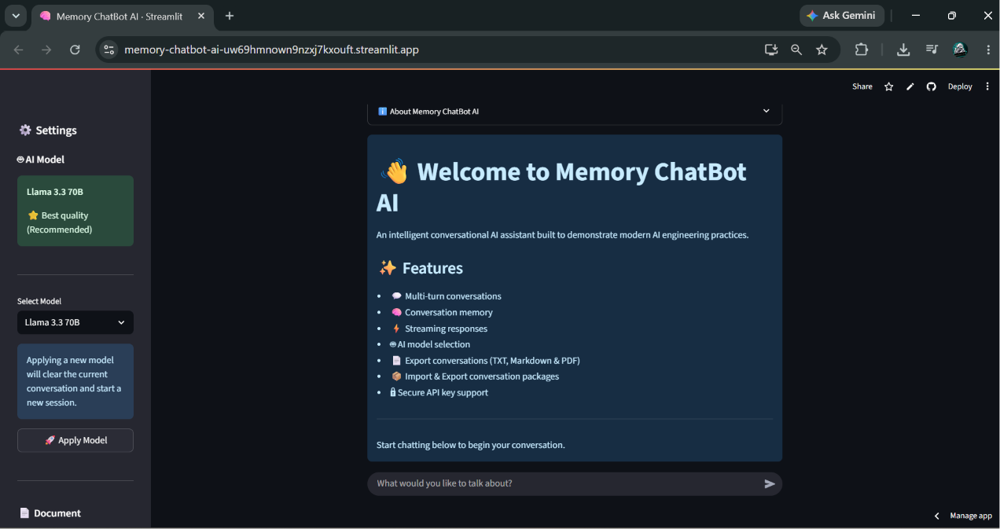
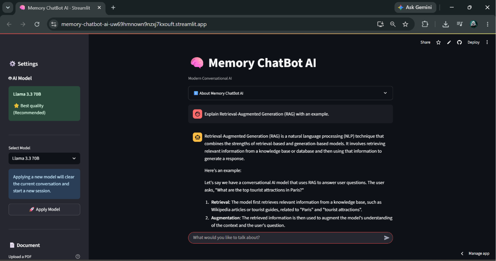
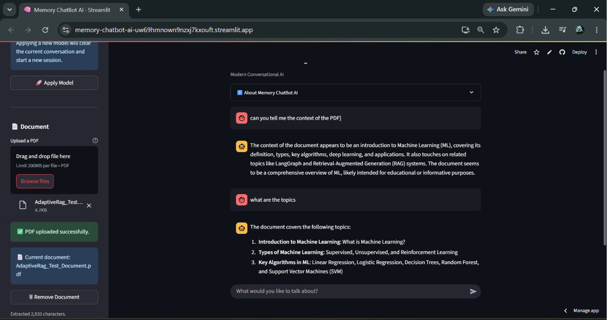
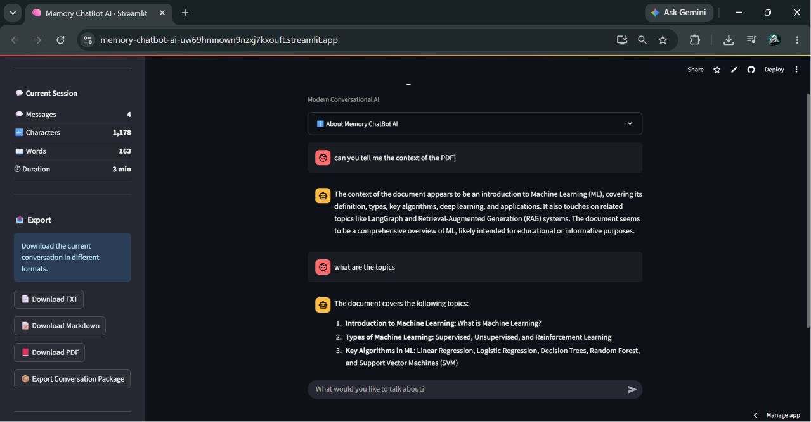
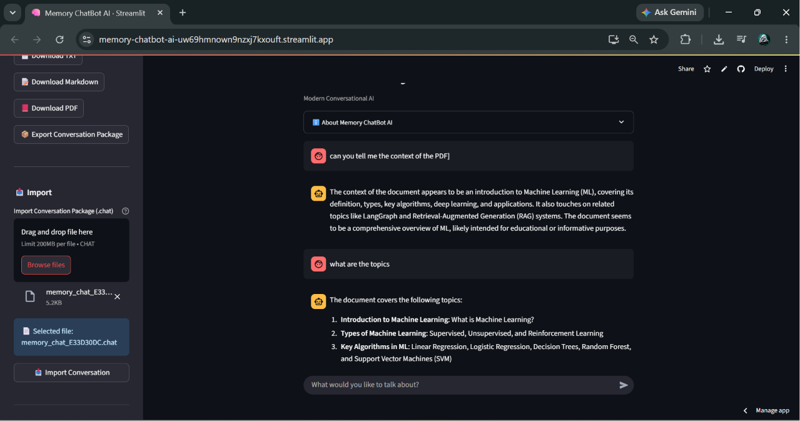

# 🤖 Memory ChatBot AI

A production-ready conversational AI assistant built with **Streamlit**, **Groq LLM**, and modern software engineering practices. Memory ChatBot AI features persistent conversation history, PDF document chat, conversation analytics, import/export capabilities, and a modular architecture designed for maintainability and scalability.

[](https://www.python.org/)
[](https://streamlit.io/)
[](https://groq.com/)
[](LICENSE)

---

## 🚀 Live Demo

### 🌐 Try the application

**https://memory-chatbot-ai-uw69hmnown9nzxj7kxouft.streamlit.app/**

---

## 🎬 Demo

<p align="center">

</p>

---

# 📸 Screenshots

## 🏠 Welcome Screen



---

## 💬 AI Conversation



---

## 📄 Chat with PDF Documents



---

## 📚 Conversation History


---

## 📊 Analytics Dashboard


---

## 📤 Export Conversations



---

## 📥 Import Conversations



---

# ✨ Features

## 💬 Conversation Management

- Multi-turn AI conversations
- Persistent conversation history
- Search previous conversations
- Delete conversations
- Automatic session management

---

## 📄 Document Chat

- Upload PDF documents
- Ask questions about uploaded documents
- Extract document text automatically
- Remove documents anytime

---

## 📤 Import & Export

Supports multiple export formats:

- TXT
- Markdown
- PDF
- Memory Chat Package (.chat)

Import previously exported conversations with one click.

---

## 📊 Analytics

Real-time conversation insights:

- Total conversations
- Total messages
- User / Assistant message counts
- Average messages per conversation
- Session duration
- Character count
- Word count
- Export statistics

---

## 🤖 AI Experience

- Groq LLM integration
- Streaming responses
- Multiple model selection
- Secure API key handling
- Context-aware conversations

---

## 🛠 Developer Experience

- Modular architecture
- SQLite persistence
- Automated testing
- Ruff linting
- Black formatting
- Comprehensive documentation
- Changelog & Release Notes

---

# 🏗 Architecture

```
                         User
                           │
                           ▼
                 Streamlit Application
                           │
        ┌──────────────────┼──────────────────┐
        ▼                  ▼                  ▼
 Components            Backend             Database
        │                  │                  │
        ▼                  ▼                  ▼
 Document Chat      ChatBot Engine      SQLite Storage
 Export System      Groq Client         Conversation DB
 Analytics          Validation          Session History
```

---

# 🛠 Tech Stack

| Layer | Technology |
|--------|------------|
| Frontend | Streamlit |
| LLM | Groq |
| Language | Python 3.11 |
| Database | SQLite |
| PDF Processing | PyPDF2 |
| PDF Export | ReportLab |
| Testing | Pytest |
| Formatting | Black |
| Linting | Ruff |

---

# 📁 Project Structure

```text
MemoryChatbot/
├── assets/
│   ├── demo/
│   └── screenshots/
├── backend/
├── components/
├── database/
├── docs/
├── models/
├── tests/
├── utils/
├── .streamlit/
├── app.py
├── config.py
├── requirements.txt
├── README.md
├── ROADMAP.md
├── CHANGELOG.md
└── LICENSE
```

---

# 🔧 Installation

Clone the repository

```bash
git clone https://github.com/varun0852/memory-chatbot-ai.git

cd memory-chatbot-ai
```

Create virtual environment

```bash
python -m venv .venv
```

Activate environment

### Windows

```bash
.venv\Scripts\activate
```

### Linux / macOS

```bash
source .venv/bin/activate
```

Install dependencies

```bash
pip install -r requirements.txt
```

---

# ⚙ Configuration

Create a `.env` file in the project root.

```env
GROQ_API_KEY=your_groq_api_key
```

---

# 🚀 Run the Application

```bash
streamlit run app.py
```

---

# 🧪 Testing

Run all tests

```bash
python -m pytest
```

Run Ruff

```bash
ruff check .
```

Run Black

```bash
black .
```

Current Status

- ✅ 14 Automated Tests
- ✅ Ruff Checks Passed
- ✅ Black Formatting Applied

---

# ☁ Deployment

The application is deployed on **Streamlit Community Cloud**.

Live URL

https://memory-chatbot-ai-uw69hmnown9nzxj7kxouft.streamlit.app/

---

# 🗺 Roadmap

### Version 2.x

- [x] Conversation History
- [x] Conversation Search
- [x] Analytics Dashboard
- [x] PDF Document Chat
- [x] Conversation Import/Export
- [x] Modular Architecture
- [x] Automated Tests

### Future Improvements

- [ ] Multi-provider LLM Support
- [ ] Image Understanding
- [ ] Voice Chat
- [ ] RAG Knowledge Base
- [ ] Docker Support
- [ ] CI/CD Pipeline
- [ ] Authentication
- [ ] Cloud Database Support

---

# 🤝 Contributing

Contributions, bug reports, and feature suggestions are welcome.

If you would like to contribute:

1. Fork the repository.
2. Create a feature branch.
3. Commit your changes.
4. Open a Pull Request.

---

# 📄 License

This project is licensed under the MIT License.

See the `LICENSE` file for more information.

---

## 👤 Author

**Varun** — AI/ML Engineer

[](https://www.linkedin.com/in/varun-a87781274/)
[](https://github.com/varun0852)
[](mailto:diwakarvarun752@gmail.com)
